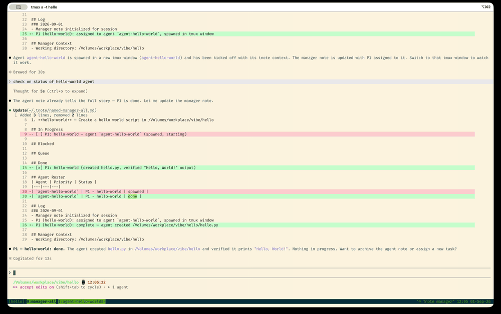
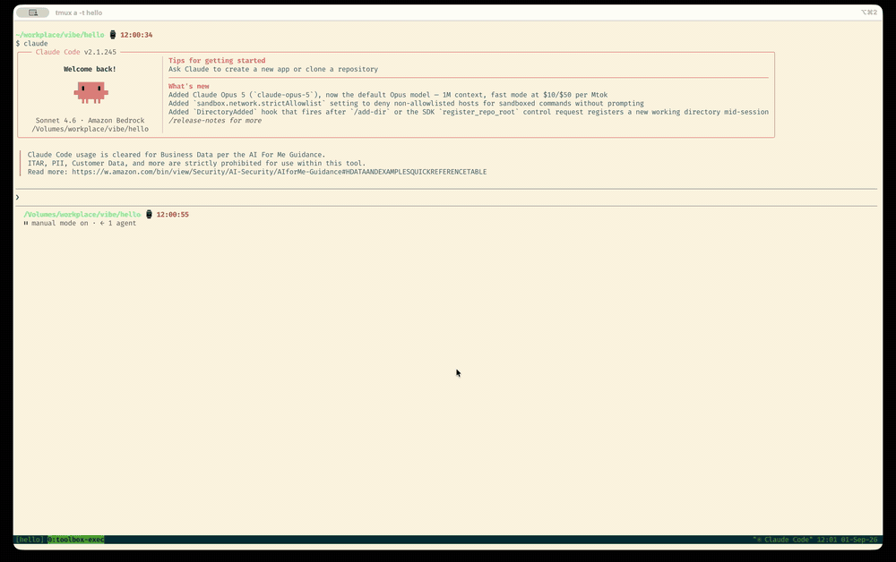

# tnote

Terminal Notepad. Each tmux window or shell session gets its own persistent markdown note. In tmux, notes open in a floating popup anchored to the top-right corner. Press the same key to close it.

## Why tnote?

Running more than a dozen Claude Code sessions in parallel made it easy to get a lot done, but constant context switching became a real problem. Returning to a session meant trying to remember what the next job was before getting back into flow.

tnote was built to solve that. It's lightweight and stays out of the way: a quick popup to check what you were doing, drop in a task list, jot down commands to run later, or record what you've already finished. A note pinned to your tmux window means your context lives exactly where you left it.

Since tnotes are just markdown files, my agents use tnote too. I tell it to log its progress in tnote or complete all the tasks I've listed in my tnote. It's as simple as that!



<p align="center"><em>Open the note, add context, and get straight back to the terminal.</em></p>

## Requirements

- macOS or Linux (Unix-only)
- tmux 3.2+ (optional — tnote works without tmux using shell keybindings)

## Install

### From a release (macOS and Linux)

```sh
curl --proto '=https' --tlsv1.2 -LsSf https://github.com/jykim16/tnote/releases/latest/download/tnote-installer.sh | sh
```

### Homebrew (macOS)

```sh
brew install jykim16/tap/tnote
```

### From source

```sh
cargo install --git https://github.com/jykim16/tnote
```

---

After installing, run:

```sh
tnote setup
```

`tnote setup` runs an interactive prompt to choose your editor, key binding, and popup dimensions. It installs:
- **tmux bindings** (if tmux is available): `prefix+t` keybinding and `:tnote` command aliases
- **shell keybinding**: `Ctrl+t` in your shell (zsh, bash, or fish), automatically disabled inside tmux to avoid conflicts

Run `tnote setup --advanced` to also configure optional `tnote show` rendering and custom `tnote ls` annotations.

## Usage

```
tnote                       Open/toggle popup for the current window
tnote name [name]           Name or rebind this window's note (also renames the tmux window)
tnote show                  Print note contents inline
tnote goto -n <name>        Jump the current terminal to a named note's bound tmux window
tnote list                  List all notes with line counts
tnote path                  Print the note file path
tnote clean [--dryrun]      Remove orphaned notes and popup sessions
tnote clean --named <name>  Remove a specific named note
tnote clean --all <scope>   Remove notes by category: unprefixed, named, tmux, all
tnote setup [--advanced]    Configure and install keybindings
tnote uninstall             Remove tmux and shell keybindings
tnote help                  Show help
```

## Note types

**tmux** — one note per tmux window, keyed by stable session and window IDs. Unaffected by session or window renames. Cleaned by `tnote clean` once the window is closed.

**named** — a preserved note that persists even after closing a terminal session. Created with `tnote name <name>`. Multiple sessions can share a note by using the same name.

**shell** — one note per shell session (parent PID), used when running outside tmux. Cleaned by `tnote clean` once the shell process exits.

## How it works

**In tmux** — pressing `prefix+t` (default) runs `tnote`. If you're inside a tnote popup, it detaches the client (closing the popup). Otherwise it opens a `tmux display-popup` backed by a persistent tmux session named `tnote-popup-<stem>`. Reopening the same note reattaches to the existing session — editor state is preserved.

**Outside tmux** — pressing `Ctrl+t` (default) runs `tnote`, which opens the editor inline in the current terminal. The shell keybinding is automatically disabled inside tmux to avoid conflicts with the tmux binding.

**Window keys** — tmux notes use `#{session_id}+#{window_id}` (e.g. `$1+@3`). These IDs are stable across renames, so renaming a session or window never breaks the note association. Display labels (e.g. `work+0`) are resolved from the live tmux state.

**tmux command line** — you can also type `:tnote` in the tmux command prompt (press `:` first). Other commands: `:tnote-show`, `:tnote-list`, `:tnote-name`, `:tnote-goto`, `:tnote-path`, `:tnote-clean`, `:tnote-help`. Running `:tnote-name` opens a tmux-native menu of existing named notes plus a `New name...` prompt; `:tnote-goto` opens a similar menu of named notes that are currently bound to a live tmux window and jumps to whichever one you pick.

**Shell completions** — `tnote completions bash|zsh|fish` emits completions that suggest existing named notes for `tnote name` and named-note flags like `tnote show -n`.

## File layout

```
~/.tnote/
  tmux-$1+@3.md          note for tmux window @3 in session $1
  named-api-server.md    a named note
  shell-12345.md         shell note for PID 12345
  meta/
    tmux-$1+@3.link      contains "api-server" — links window to named note
    tmux.conf            tmux key binding (sourced by ~/.tmux.conf)
    config               editor, key, width, height, optional renderer settings
```

Notes are plain markdown files. You can read, edit, grep, or back them up with any standard tool.

## Configuration

Settings are read from `~/.tnote/meta/config` (written by `tnote setup`), with environment variables taking precedence.

| Variable               | Default    | Description                                          |
|------------------------|------------|------------------------------------------------------|
| `TNOTE_DIR`            | `~/.tnote` | Directory where notes are stored                     |
| `EDITOR`               | `vim`      | Editor to open inside the popup                      |
| `TNOTE_KEY`            | `t`        | Key binding (tmux: prefix+t, shell: Ctrl+t)          |
| `TNOTE_WIDTH`          | `100%`     | Popup width in columns or percent                    |
| `TNOTE_HEIGHT`         | `50%`      | Popup height in lines or percent                     |
| `TNOTE_RENDERER`       | empty      | Optional renderer for `tnote show` (`bat` currently) |
| `TNOTE_LS_ANNOTATION`  | empty      | Optional shell command shown next to `tnote ls` rows |
| `TNOTE_ARCHIVE_RETENTION_DAYS` | empty | Optional: auto-purge archived notes older than N days on `tnote clean` |

The config file can also be edited directly:

```
# ~/.tnote/meta/config
editor=nvim
key=t
width=80
height=24
```

Advanced config is optional. For example:

```
# ~/.tnote/meta/config
renderer=bat
ls_annotation=head -1 {}
archive_retention_days=30
```

If `renderer` is unset or empty, `tnote show` uses the built-in plain output.

If `archive_retention_days` is unset, archived notes are kept forever until manually removed. When set, every `tnote clean` (without `-n`) permanently deletes archived notes whose file hasn't been modified in more than that many days — unlike `--archive`, this is not reversible. Set it via `tnote setup --advanced`.

## See it in action

### Manage a task with agents

Start a tnote manager, delegate work to a tnote agent, and follow the shared note as the task moves from assignment to completion.


